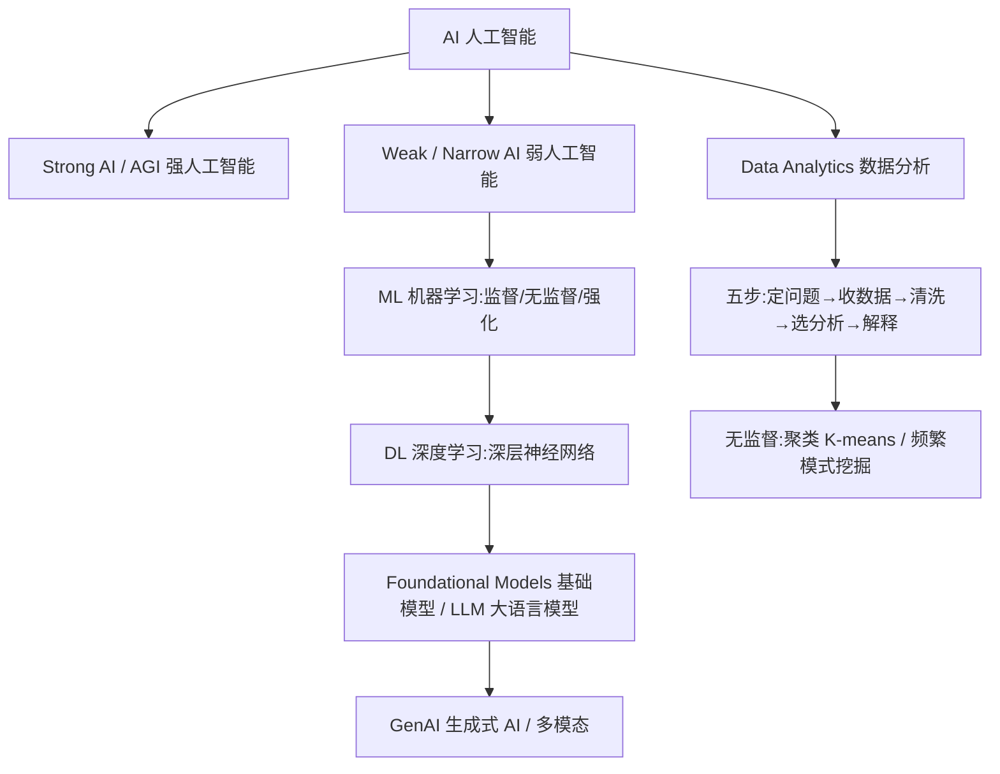

## 📎 原始课件
- [L1 课件原文（提取文本）](files/eie1005/l1-original.txt)

# EIE1005 · Lecture 1 讲义
## Introduction to AI and Machine Learning, and Data Analytics

> 课程:EIE1005 Fundamental AI and Data Analytics(香港理工大学 · 电气与电子工程学系)
> 材料:01-IntroAIMLDA2026.pdf(71 页)| 讲义目标:真正学懂
> 原文见 `L1_课件原文.txt`

---

## 一句话总结

AI 是"让机器做需要人类智能的事";机器学习(ML)是实现窄 AI 的主要途径、深度学习(DL)是 ML 里用深层神经网络的那一支、大模型(LLM)和生成式 AI(GenAI)是近年最强应用;而"数据分析"是把 AI/ML/DL/GenAI 当工具,按「定问题 → 收数据 → 洗数据 → 选分析 → 解释结果」五步用数据回答问题。

---

## 全局定位

- **解决什么问题**:给你一张"AI 地图"——各种 AI 名词(AI/ML/DL/LLM/GenAI/基础模型)到底是什么关系;以及数据分析的标准流程。
- **学科位置**:全课的开篇导论,定义清晰程度决定后面每讲的理解;L2 的 CV/神经网络就是本讲"ML/DL"的具体展开。
- **逻辑主线**:AI 的定义与强弱 → ML/DL/LLM/GenAI 层层包含关系 → 数据分析五步 → 两个无监督例子(聚类、频繁模式挖掘)。

---

## 知识地图

---

## 术语墙

| English | 中文 | 词根拆解 | 发音提示 | 一句话白话 |
| --- | --- | --- | --- | --- |
| Artificial Intelligence | 人工智能 | art=技艺+fic=造 | 阿-替-菲-秀 因-泰-利-真斯 | 让机器像人一样想问题 |
| Turing Test | 图灵测试 | 人名 Turing | 图-灵 泰-斯特 | 人机对话,分不出哪个是机器就算通过 |
| AGI (Strong AI) | 通用人工智能 | general=通用 | 艾-吉-艾 | 什么都会的"全能 AI"(目前还没有) |
| Narrow AI (Weak AI) | 窄人工智能 | narrow=窄 | 奈-柔 艾 | 只擅长一件事的 AI(AlphaGo、翻译) |
| Machine Learning | 机器学习 | machine=机器 | 么-西-恩 勒-宁 | 不靠写死规则,让程序从数据里学 |
| supervised / unsupervised learning | 监督/无监督学习 | super=上+vis=看 | 苏-珀-外-兹德 / 安-苏-珀-外-兹德 | 有标签 / 没标签 地学 |
| reinforcement learning | 强化学习 | reinforce=加强 | 瑞-因-佛-斯-门特 | 靠"奖励/惩罚"试错学 |
| Deep Learning | 深度学习 | deep=深 | 迪-普 勒-宁 | 用多层神经网络的机器学习 |
| neural network | 神经网络 | neuro=神经 | 纽-惹 奈-特-沃克 | 模仿神经元连接的计算模型 |
| LLM | 大语言模型 | large language model | 艾-欧-艾-姆 | 海量文本训练出的"会说话"的大模型 |
| transformer | 变换器架构 | transform=变换 | 川斯-佛-么 | 能抓长距离依赖的现代模型骨架 |
| foundational model | 基础模型 | foundation=地基 | 方-代-申-呢 莫-德尔 | 大而全、可微调复用的底座模型 |
| fine-tuning | 微调 | fine=细+tune=调 | 法因-图-宁 | 在底座模型上小改适配新任务 |
| few-shot / zero-shot | 少样本/零样本 | shot=次 | 菲尤-肖特 / 齐-柔-肖特 | 给几个/一个例子都不给就会做 |
| Generative AI | 生成式人工智能 | generate=生成 | 杰-呢-瑞-替夫 艾 | 会"创作"新内容的 AI |
| multimodal | 多模态 | multi=多+modal=模态 | 么-提-莫-德尔 | 能同时处理文字/图/声音 |
| Data Analytics | 数据分析 | ana=向上+lyze=分解 | 得-塔 安-呢-利-提克斯 | 用数据回答问题 |
| quantitative / qualitative | 定量/定性 | quant=数量 | 匡-提-特-替夫 / 匡-利-替夫 | 数值型 / 描述型 数据 |
| first-party data | 第一方数据 | party=方 | 佛-斯特-帕-提 | 自己直接收集的数据 |
| Data Wrangling | 数据整理/清洗 | wrangle=驯服 | 得-塔 然-格-灵 | 把数据洗成能用 |
| outlier | 离群点 | out=外+lier=躺 | 奥特-莱-尔 | 明显偏离的异常值 |
| deduplication | 去重 | de=去+duplicate=重复 | 迪-丢-普利-凯-申 | 删除重复记录 |
| clustering | 聚类 | cluster=簇 | 克-拉-斯特-灵 | 把相似的东西分到一组 |
| K-means | K 均值 | mean=均值 | 凯-米-恩斯 | 用 K 个中心点分组的经典聚类 |
| centroid | 质心 | centr=中心 | 森-绰伊德 | 一组的"重心"代表点 |
| frequent pattern mining | 频繁模式挖掘 | frequent=频繁 | 弗-瑞-昆特 派-特恩 迈-宁 | 从海量交易里找常一起出现的组合 |
| association rule | 关联规则 | associate=关联 | 阿-搜-西-艾-申 入-欧 | "买了 A 往往也买 C"的规则 |
| support | 支持度 | support=支撑 | 瑟-波特 | 组合出现占总交易的比例 |
| confidence | 置信度 | confident=确信 | 康-非-登斯 | 规则"靠不靠谱"的条件概率 |
| descriptive / diagnostic / predictive | 描述性/诊断性/预测性分析 | scribe=写 / gnos=知道 / dict=说 | 迪-斯克-瑞普-提夫 等 | 总结现状 / 找原因 / 预测未来 |

---

## 逐节讲义

### 第 1 节 AI 的定义与强弱之分

- **一句话看懂**:AI = 让计算机做"本来需要人脑"的事;现在能落地的都是"只擅长一件事"的弱 AI,什么都会的强 AI(AGI)还没出现。
- **直觉/类比**:弱 AI 像"专精一门的手艺人"(AlphaGo 只会下围棋,但天下无敌);强 AI 像"通才"(还没造出来)。
- **严谨定义**:
  - AI:开发能完成"通常需要人类智能"的任务的系统与算法,任务包括学习、推理、问题求解、感知、自然语言理解。
  - 强 AI/AGI:假设中拥有人类级或超人类通用智能的 AI;三大特征 = 通用智能、适应性与自我改进、意识与自我意识。
  - 弱 AI(窄 AI):为特定任务设计的专用系统,可在窄领域超越人类(图像识别、翻译、围棋),如 AlphaGo、垃圾邮件过滤。
- **例子**:图灵测试——如果机器的回答让人分不出是人还是机器,就认为它有智能(《模仿游戏》讲的就是图灵)。
- **易错点**:AGI 目前只存在于科幻(龙珠 16/19 号、奥创);"离我们很近"是观点不是事实,考试别写成"已实现"。
- **自测**:1) 强 AI 的三大特征?2) AlphaGo 属于强 AI 还是弱 AI,为什么?
  **答案**:1) 通用智能、适应/自我改进、意识/自我意识;2) 弱 AI,只会围棋这一窄域。

### 第 2 节 AI → ML → DL → LLM → GenAI 的包含关系

- **一句话看懂**:AI ⊃ ML ⊃ DL;LLM 是 GenAI 的"语言分支";基础模型比 LLM 更宽。这是本讲最重要的一张关系图。
- **直觉/类比**:AI 是"机器智能"这个大学科;ML 是"自己从数据学"这个流派;DL 是流派里"用深层神经网络"的先锋队;GenAI 是先锋队里"会创作"的明星;LLM 是明星里"专写文字"的那位。
- **严谨定义(按课件原义)**:
  - ML:实现弱 AI 的一种方式;让软件不靠显式编程也能更准确地预测结果;含监督/无监督/强化学习;经典算法:SVM、决策树、随机森林。
  - DL:ML 的子集,用分层神经网络(深度网络)建模复杂模式;擅长图像/语音/语言;需要大数据与大量算力。
  - LLM:用海量文本语料训练的神经网络,生成连贯、有上下文的类人文本;基于 transformer;例子 GPT-3/4/5、PaLM、Codex。
  - 基础模型:在大规模多样数据上预训练的大模型,可微调用于下游任务;例子 GPT(语言)、DALL·E(图像)、CLIP(多模态);带来 few-shot / zero-shot。
  - GenAI:能基于学到的模式"创作"新内容(文本/图像/音频/视频)的系统,不同于只做分类/预测的传统 AI。
- **关系表述(会考)**:GenAI 是"任何生成内容的 AI"的宽泛总称;LLM 是专注于语言的 GenAI;基础模型范围更广、可以生成也可以做其他任务。**所有 LLM 都是基础模型,但不是所有基础模型都是 LLM。**
- **多模态**:现代 GenAI 可跨文本/图像/音频,如 DALL·E 文生图、CLIP 图文关联。
- **易错点**:把 GenAI 和 LLM 当同义词(错);DL 不是独立于 ML 的学科(是子集)。
- **自测**:1) 画 AI/ML/DL 的包含关系。2) 判断:所有基础模型都是 LLM,对吗?
  **答案**:1) AI ⊃ ML ⊃ DL;2) 不对,LLM ⊂ 基础模型。

### 第 3 节 大模型的训练、伦理与趋势

- **一句话看懂**:大模型 = 海量数据 + GPU/TPU + 亿级/万亿级参数,训练极贵;能力强但伴随偏见、假消息、版权、能耗四类风险。
- **训练与资源**:需要大规模数据集、强大 GPU/TPU、长时间训练;参数从数十亿到数万亿;微调(fine-tuning)让底座模型适配特定行业。
- **伦理风险四件套(会考)**:偏见与公平(bias/fairness)、错误信息与深度伪造(misinformation/deepfakes)、知识产权(IP)、环境影响(碳足迹)。
- **未来方向**:模型更大更高效;更强的多模态与交互;可解释性/可控性;AI 对齐(alignment)人类价值观。
- **与你专业结合(EE/ME/BME/AIIE 用例,课件给出)**:EE→预测性维护、故障诊断、电网优化;ME→设计/拓扑优化、CFD、预测性维护;BME→药物发现、医学影像、个性化医疗。考试可能让你举本专业例子。
- **自测**:1) 大模型的四大伦理风险?2) 举 2 个 EE 专业的 AI 应用。
  **答案**:1) 偏见公平、错误信息/深度伪造、知识产权、环境影响;2) 预测性维护、故障检测等。

### 第 4 节 数据分析是什么 + 五步流程

- **一句话看懂**:数据分析 = 用数据回答问题,并把 AI/ML/DL/GenAI 当工具找答案;标准流程五步。
- **五步流程(必背)**:1) Define Questions and Goals 定问题与目标 → 2) Collect Data 收集数据 → 3) Data Wrangling 数据整理(质量+预处理)→ 4) Determine Analysis 选择分析方法 → 5) Interpret Results 解释结果。
- **经典例子**:Netflix 个性化推荐;Facebook 信息流排序;Walmart 看购买记录+社交动态决定备货(飓风前草莓味 Pop-Tarts 会卖爆);体育界找未来球星;药企预测有效化合物。
- **Step1 定问题**:定义问题陈述与目标,提出假设并设计检验方式;分析师要把问题框对。
- **自测**:1) 默写五步。2) 用一句话说明"数据分析"。
  **答案**:1) 见上;2) 用数据回答问题,借助 AI/ML 等方法找答案。

### 第 5 节 收集数据:类型与来源

- **一句话看懂**:数据分"数字(定量)"和"描述(定性)";来源分第一方/第二方/第三方。
- **类型**:Quantitative 定量(数字,销售额、分数);Qualitative 定性(描述,访谈、评论)。
- **来源(重点区分)**:
  - First-party 第一方:自己直接从客户收集(销售记录、CRM),干净且结构化;
  - Second-party 第二方:别人组织的第一方数据,经公司或私域市场获得,结构化、较可靠但相关性略低;
  - Third-party 第三方:第三方机构从多来源汇总,量大、常非结构化(big data),用于行业报告/市场研究,也可向公司售卖;开源数据/政府门户也是。
- **易错点**:第一方≠"第一手最有价值就一定最好",只是最相关;第二方本质是"别人的第一方"。
- **自测**:1) 定量与定性各举一例。2) 自己 CRM 里的销售记录属于哪方数据?
  **答案**:1) 销售额/访谈;2) 第一方。

### 第 6 节 数据整理(Data Wrangling)与数据质量

- **一句话看懂**:数据要"洗干净"才能用;分析师约 27% 时间在洗数据。五大质量问题:缺失、冗余、不一致、噪声、离群点。
- **五大问题**:
  - Missing values 缺失值:原因多样(后期才记录、采集时不知道、拒答、设备故障、打标签成本高);处理:忽略缺失、改算法兼容、删除该对象、估计填补。
  - Redundancy 冗余:多余/重复且不带新信息的数据;去重(deduplication)识别并删除副本,否则 ML 会过度加权重复对象。
  - Inconsistency 不一致:值之间违反已知关系(A 应 > B 却相反、负数却出现正数约束);不一致会降低模型质量。
  - Noise 噪声:不满足预期标准的数据,来自测量失真、人为错误、样本污染;注意"噪声"不一定是错的。
  - Outliers 离群点:与其他对象差异极大的值;**离群点可能是合法值**,有些分析的目标就是找离群点(欺诈检测)。
- **尺度转换(Converting scale)**:有些算法只能用特定尺度;定性↔定量可互转;二元属性只有 0/1;大量 0 的叫稀疏数据(sparse,有些算法处理困难);顺序值(ordinal)可转自然数(最小=0,依次+1)。
- **易错点**:outlier ≠ noise——离群点可能是真实极端值;稀疏≠无效。
- **自测**:1) 数据质量五大问题。2) 离群点为什么不一定该删?
  **答案**:1) 缺失/冗余/不一致/噪声/离群点;2) 可能是合法极端值,且有些任务(异常检测)正是要找出它们。

### 第 7 节 选分析方法与解释结果

- **一句话看懂**:选哪种分析由"要回答的问题"决定;最后要把结论讲得人人听得懂、站得住脚。
- **三类分析(会考)**:
  - Descriptive 描述性:总结现状("发生了什么");
  - Diagnostic 诊断性:找原因与解法("为什么会发生");
  - Predictive 预测性:历史数据+统计建模预测未来("将来会怎样")。
- **Step5 解释结果**:把洞察分享出来,报告/仪表盘/可视化支撑,讲得通俗、证据齐全、结论科学可信。
- **自测**:1) 想找"客户流失原因"用哪种分析?2) 预测下季度销量用哪种?
  **答案**:1) 诊断性;2) 预测性。

### 第 8 节 聚类与 K-means(无监督)

- **一句话看懂**:没标签时,把"相似的"分到一组;K-means 用 K 个质心反复"分—算—分"直到稳定。
- **直觉/类比**:老师让同学按身高自动站成 K 队:先随机定 K 个队长位置,大家站到最近队长那队,队长移到队中间,大家重新站……直到没人换队。
- **严谨定义**:聚类把数据集分成若干组,同组对象相似;是无监督学习。K-means 是最流行的"划分式、基于原型"的聚类。
  - Centroid 质心 = 一组实例的"重心";K-means 让"簇内各点到质心的距离平方和"最小。
- **K-means 五步(必背)**:①随机定义 K 个初始质心 → ②每个实例归到最近质心 → ③用组内所有实例重算质心 → ④按新质心重新归类 → ⑤重复③④直到没有实例换组。
- **自测**:1) 聚类是监督还是无监督?2) K-means 中质心是什么?
  **答案**:1) 无监督;2) 一组的重心代表点。

### 第 9 节 频繁模式挖掘(关联规则)

- **一句话看懂**:从"海量购物篮"里找"买了 A 常也买 C"的规律,用支持度+置信度筛出合格规则。
- **直觉/类比**:超市小票分析——发现买尿布的人常买啤酒,就摆在一起卖。
- **严谨定义**:
  - Itemset 项集:一个或多个 item 的集合;含 k 个 item 叫 k-项集。
  - Association rule 关联规则:A ⇒ C(A 前件 antecedent,C 后件 consequent,两者无共同项);若交易中出现 A,通常也出现 C。
  - Support 支持度:含某 itemset 的交易占比;规则的支持度 = 前后件并集的支持度。
  - Confidence 置信度:规则可靠性 = support(A∪C) / support(A)。
  - 合格规则:支持度 ≥ minsup 且 置信度 ≥ minconf。
- **例子(课件数据)**:{Indian, Oriental} 支持度 = 5/10 = 50%;规则 {Indian, Mediterranean} ⇒ {Oriental} 支持度 = 3/10 = 30%;置信度 = (3/10)/(4/10) = 75%。
- **自测**:1) 支持度与置信度的区别?2) minsup=minconf=60% 时上面规则合格吗?
  **答案**:1) 支持度=出现频率,置信度=在前件出现时后件出现的条件比例;2) 不合格——支持度 30% < 60%(尽管置信度 75% ≥ 60%)。

---

## 查缺补漏(课件没细讲,但学懂必需)

1. **AI ⊃ ML ⊃ DL 的严谨表述** — DL 是 ML 的子集,而 ML 是实现(弱)AI 的方法;三者不是并列关系。
2. **监督/无监督/强化的区别** — 监督=有标签(分类/回归);无监督=没标签(聚类/关联);强化=靠奖励试错(下棋、机器人控制)。课件只点名没展开,后续讲会用到。
3. **支持度/置信度为什么需要两个指标** — 只有置信度高会被"冷门但巧合"骗;只有支持度高会被"常见但无因果"骗。两个一起用才能筛出好规则(还有第三个指标 lift 提升度,教材进阶)。
4. **Turing Test 的现代争议** — 对话能力 ≠ 理解/意识;现在 LLM 常能通过对话测试,但普遍认为这不足以证明 AGI。
5. **训练/验证/测试集** — 课件 L2 会讲训练/测试;更严谨还有验证集调参,避免过拟合。
6. **第一/二/三方数据的本质** — 按"数据从哪来、谁拥有"划分,核心区别是相关性/可信度/成本。
7. **K-means 的局限** — 要事先定 K;对初始点敏感;只能找"球形簇";对离群点敏感(这是教材进阶,课堂只需掌握五步流程)。
8. **参考教材** — J. Moreira, T. Horvath, A. Carvalho, *A General Introduction to Data Analytics*(第 4–6 章),数据部分考题大概率出自此书。

---

## 高频考点与口诀

- **包含关系**:AI ⊃ ML ⊃ DL;LLM ⊂ 基础模型;LLM ⊂ GenAI。
- **强弱 AI**:弱 AI = 专用超人(AlphaGo);强 AI/AGI = 通用(未实现,三特征)。
- **数据分析五步**:定问题 → 收数据 → 洗数据 → 选分析 → 解结果(口诀「定收洗选解」)。
- **数据来源**:一/二/三方 = 自己 / 别人的一方 / 第三方汇总。
- **数据质量五问题**:缺、冗、不一、噪、离群。
- **三类分析**:描述(现状)、诊断(原因)、预测(未来)。
- **K-means 五步**:定质心 → 归组 → 重算 → 再归 → 重复到稳定。
- **关联规则**:支持度(频率)、置信度(可靠)= S(A∪C)/S(A);合格 = 双阈值。

---

## 费曼复述任务

合上讲义,用大白话讲两段(每段 1 分钟):
1. 「AI 大家庭怎么排辈分」:AI 是爷爷,机器学习是爸爸,深度学习是儿子;会写字的明星 LLM 属于生成式 AI 一族,基础模型是它背后的大底座。
2. 「数据分析怎么干活」:先想清楚问什么 → 收集数据(谁的、数值还是描述)→ 洗干净(缺的补、重的删、错的对齐、怪的分清是噪声还是宝贝)→ 选方法(描述/诊断/预测)→ 把结论讲明白。

必须覆盖:① AI/ML/DL 包含关系 ② 强弱 AI ③ 五步流程 ④ 数据质量五问题 ⑤ 支持度 vs 置信度。

---

## 待核实清单

- ⚠️ P13(课件页码显示 29/08/2026 日期标注为课堂讲授日),考试以老师最新口径为准。
- ⚠️ "AI Today: Near-AGI"一节为观点性内容(LLM 是否接近 AGI),答题区分"事实"与"观点"。
- ⚠️ 频繁模式挖掘例题中 "Fast food" 支持度=2/10,与表格数值请回原课件核对。
- ⚠️ 参考教材章节(Ch4–6)对应数据预处理/聚类/关联,建议考前翻一遍。

---

## 答疑补充（合并自原「答疑笔记」第 1–3 问）

### 为什么前面的 Training set 有「特征」，后面的 training data 没有？
- 经典 PR：流水线有显式「特征提取」步骤，训练集 = 人工设计的「特征向量 + 标签」。
- 神经网络（MNIST）：训练数据 = 「原始像素 + one-hot 期望输出」，特征由隐藏层自动学习。
- 易错：784 个像素本身也是输入特征；区别是「人工设计 hand-crafted」vs「自动学习 learned」。训练本质 = 学权重 = 学会提取什么特征。

### 人工算特征再分类，属于什么学习？
- 属于监督学习（有标签）；更精确说是其中「人工设计特征」的经典 PR 做法。
- 神经网络同样是监督学习，差别只在特征来源（人工 vs 自动）。

### 经典 PR 与「社交网络分析」的关系？
- 不是并列关系：社交网络分析是场景/数据，经典 PR 是方法家族。
- 经典 PR 两大家族：监督·分类（有标签，如 MNIST）；无监督·聚类（没标签，如 L1 的 Simple Social Network，K-means k=4）。
- 课件用社交网络举例是为演示 K-means 五步（定质心→归组→重算→再归→稳定）。真实社区发现 ≠ K-means。
