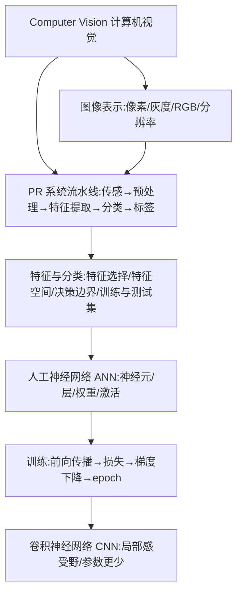

# EIE1005 · Lecture 2 讲义
## AI and Data Analytics for Computer Vision

> 课程:EIE1005 Fundamental AI and Data Analytics(香港理工大学 · 电气与电子工程学系)
> 讲师:Prof. Y.L. Chan | 材料:L2 Lecture Notes.pdf(68 页)
> 讲义目标:真正学懂(直觉先行 → 严谨定义 → 公式推导 → 查缺补漏 → 自测)
> 本文由课件原文整理而成,原文见 `EIE1005_L2_课件原文.txt`

---

## 一句话总结

计算机视觉 = 让计算机"看懂"图片:先把图片变成数字(像素矩阵),再按「传感 → 预处理 → 特征提取 → 分类」这条流水线把数字变成标签;为了让机器自己学会找特征,引入神经网络(ANN),并用「前向传播 + 损失 + 梯度下降」训练权重;CNN 则是针对图像专门省参数的网络结构。

---

## 全局定位

- **解决什么问题**:机器如何从图像中自动识别物体(分类)。
- **学科位置**:是「机器学习(Machine Learning)」的一个应用分支;本讲从经典模式识别(PR)过渡到神经网络,为后面更深的 CNN/深度学习打地基。
- **逻辑主线**:图像怎么表示 → 经典 PR 流水线 → 特征与分类 → 神经网络为何有效 → 网络怎么训练 → CNN 怎么省钱。

---

## 知识地图



---

## 术语墙(本讲全部专业词汇)

| English | 中文 | 词根拆解 | 发音提示 | 一句话白话 | 常用符号 |
| --- | --- | --- | --- | --- | --- |
| Computer Vision | 计算机视觉 | vision=看 | 肯-皮优-特 维-任 | 让计算机看图识物 | CV |
| Pattern Recognition | 模式识别 | pattern=模式 | 帕-特恩 瑞-可-格-尼-申 | 靠特征规律给东西归类 | PR |
| pixel | 像素 | pic+element | 匹克-搜 | 图像的最小格子 | — |
| grayscale | 灰度图 | gray=灰+scale=刻度 | 格瑞-斯给欧 | 只有黑白灰的图 | — |
| resolution | 分辨率 | re+solve=解开 | 瑞-佐-路-申 | 横×竖有多少像素 | H×V |
| RGB | 红绿蓝 | Red+Green+Blue | 阿-吉-必 | 用红绿蓝三色配出所有颜色 | R,G,B |
| sensor | 传感器 | sens=感觉 | 森-瑟 | 采集真实世界数据的设备 | — |
| pre-processing | 预处理 | pre=前+process=加工 | 普瑞-普绕-塞-兴 | 先洗一遍数据再分析 | — |
| image enhancement | 图像增强 | enhance=加强 | 因-汉-斯-门特 | 锐化边缘让特征更明显 | — |
| feature extraction | 特征提取 | ex=出+tract=拉 | 费-彻 伊-斯-抓-克-申 | 从图里抽出有用的"指标" | x |
| feature vector | 特征向量 | vector=带方向的量 | 费-彻 维-克-特 | 一组特征组成的向量 | **x** |
| feature space | 特征空间 | space=空间 | 费-彻 斯-贝斯 | 用特征当坐标轴画图的空间 | R^n |
| classifier | 分类器 | class=类别+ify=使 | 克-拉-西-法-耶 | 判断样本属于哪一类的程序 | — |
| decision boundary | 决策边界 | decide=决定 | 迪-西-任 邦-德-瑞 | 两类区域的分界线 | — |
| training set / test set | 训练集/测试集 | train=训练 test=测试 | 春-宁 塞特 / 泰-斯特 塞特 | 用来学 / 用来考 | H |
| induction / deduction | 归纳/演绎 | in=入+duct=引 / de=下 | 因-达克-申 / 迪-达克-申 | 从例子总结规律 / 用规律推结论 | — |
| neuron | 神经元 | neuro=神经 | 纽-荣 | 网络里"接收数据并传出去"的小计算单元 | — |
| perceptron | 感知机 | percept=感知 | 珀-塞普-创 | 最简神经元:加权求和 | — |
| hidden layer | 隐藏层 | hide=藏 | 黑-登 雷-耶 | 输入输出之间的中间层 | — |
| fully connected | 全连接 | full=全+connect=连 | 富-利 肯-奈-克-特 | 两层之间神经元两两相连 | FC |
| weight / bias | 权重/偏置 | weigh=称重 | 维-特 / 拜-厄斯 | 每个输入的重要程度 / 平移量 | w, b |
| activation | 激活(输出) | act=行动 | 艾-克-替-维-申 | 神经元算出来的输出值 | a |
| loss | 损失 | lose=丢失 | 劳-斯 | 预测和正确答案差多少 | L |
| gradient descent | 梯度下降 | grad=步+descend=下 | 格瑞-迪-恩特 迪-森特 | 沿最陡方向下山找最小损失 | ∇, η |
| epoch | 轮次 | 希腊词"循环" | 伊-波克 | 把训练集完整过一遍 | — |
| feedforward | 前向传播 | feed=喂+forward=向前 | 费德-佛-沃德 | 从输入往输出正向算一遍 | — |
| one-hot vector | 独热向量 | one hot=只有一个1 | 万-哈特 维-克-特 | 只有正确答案那位是 1,其余是 0 | — |
| convolution | 卷积 | con=一起+volv=卷 | 肯-沃-卢-申 | 用小窗口在图上滑动提取局部特征 | ∗ |
| receptive field | 感受野 | receive=接收 | 瑞-塞普-提夫 菲尔德 | 一个神经元能看到的局部区域 | — |

---

## 逐节讲义

### 第 1 节 计算机视觉与模式识别是什么

- **一句话看懂**:人靠"特征"(毛、尖耳朵、长尾巴)认猫狗;让机器做同样的事,就是模式识别 + 计算机视觉。
- **直觉/类比**:小孩见多了猫狗,大脑里"猫的特征集合"就成型了——训练网络也是不断给它看样本,让连接变强。
- **图示**:
  ```
  眼睛(传感器)→ 大脑视觉皮层(处理)→ "这是一只猫"(标签)
  ```
- **严谨定义**:
  - Pattern Recognition(PR):靠 patterns/features 判断物体类型。
  - Computer Vision(CV):Machine Learning 中处理图像识别与分类的分支。
- **应用清单(会考)**:人脸检测与识别、隐私保护、人类动作识别(Run/Hop/Jump…)、OCR 光学字符识别、车牌识别 LPR、身份认证。
- **例子**:LPR 把车牌照片实时转成数字文本,用于无人停车、收费、盗车侦测。
- **易错点**:PR 不只用于图像,也用于视频、数字、文本——课件明确说了"any type of data"。
- **自测**:
  1. 用一句话定义 Pattern Recognition?
  2. 列举 3 个 CV 应用。
  **答案**:1) 依靠模式/特征判断物体类型的系统;2) 人脸识别、动作识别、OCR/LPR 等(任选三)。

### 第 2 节 计算机怎么"看"图:数字图像基础

- **一句话看懂**:图像就是数字矩阵,格子叫像素;灰度 8 bit(0~255,256 级),彩色 RGB 三通道共 24 bit。
- **直觉/类比**:像马赛克拼图——格子越细越清楚;每个格子存一个数字代表亮度/颜色。
- **公式与推导**:
  - 图像大小(bits)= 水平分辨率 × 垂直分辨率 × 通道数 × 每通道位数
  - 算例(课件 P21):1920 × 1080 × 3 × 8 = 49,766,400 bits
- **例子**:1280×720 RGB 8bit 图 = 1280×720×3×8 = 22,118,400 bits(约 2.64 MB)。
- **易错点**:灰度 8 bit 是 256 级不是 8 级;彩色 24 bit = 三通道各 8 bit。
- **自测**:
  1. 计算 100×100 的灰度 8bit 图大小。
  2. 为什么彩色图是 24 bit?
  **答案**:1) 100×100×1×8 = 80,000 bits;2) R/G/B 三通道各 8 bit。

### 第 3 节 PR 系统的标准流水线

- **一句话看懂**:真实世界 → 传感器 → 预处理/增强 → 特征提取 → 分类器 → 类别标签。
- **直觉/类比**:拍照(传感器)→ 修图锐化(预处理)→ 找关键点(特征)→ 查户口(分类)→ 给名字(标签)。
- **严谨定义(重点,考试常考)**:
  - 图像增强(Image Enhancement):锐化边缘/边界/对比度,让特征更容易被检测;**不增加信息量,只扩大特征的动态范围**。
  - 预处理会把数据转换成计算机能理解的"特征"形式。
- **易错点**:增强 ≠ 增加信息;"动态范围"扩大的是"对比度",不是数据本身。
- **自测**:
  1. 默写 PR 流水线的 6 个环节。
  2. 图像增强为什么不增加信息?
  **答案**:1) Real world→Sensor→Pre-processing/enhancement→Feature extraction→Classification algorithm→Class assignment/Label;2) 只放大已有特征的差异(动态范围),没有引入新数据。

### 第 4 节 特征:选择、提取与特征空间

- **一句话看懂**:特征选得好,分类就简单;把每个样本画在以特征为坐标轴的空间里,找"分区线"。
- **直觉/类比**:区分苹果和杏——用半径 vs 用颜色,哪个更分得开就用哪个。
- **严谨定义**:
  - Feature extractor(特征提取器):输入图像,输出可分类的特征的程序。
  - Class(类):拥有共同重要属性的一组对象。
  - Classifier(分类器):输入特征向量,输出指定类别或"reject(拒绝类)"。
  - 特征选择三原则:1) 计算可行 2) 得到好的 PR 系统 3) 降维但不丢重要信息。
- **公式/图形**:
  - Feature space:样本特征向量 x 在 R^n 中的散点图(可视化要求 n ≤ 3)。
  - Decision regions(决策区域):分类器把特征空间划分成的类标签区域;Decision boundary(决策边界)是其边界,PR 系统本质上就是在找这些边界。
- **例子**:字符识别特征表——面积、高度、宽度、孔数(#holes)、笔画数(#strokes)、中心(cx,cy)。
- **易错点**:feature selection 含主观判断(judgement);边界形状有线性(piecewise)、二次(hyperbolic)、一般。
- **自测**:
  1. 特征选择三原则?
  2. 决策边界是什么?
  **答案**:1) 计算可行/系统性能好/降维不丢信息;2) 分类器划分出的决策区域之间的分界线。

### 第 5 节 分类:训练、测试、归纳与演绎

- **一句话看懂**:给一堆带标签的样本(训练集)学出模型,再用没见过的样本(测试集)考它。
- **严谨定义(课件 P34 原义)**:
  - 训练集 H:一组"典型"样本,每个样本的特征和类别已知,共 m 个样本、c 个类。
  - 分类(Classification):给定训练集(每条记录含特征+类),学习一个"类 = f(特征)"的模型,目标是给未见过的记录尽量准确地分到某类。
  - 测试集用来检验模型准确率;数据通常分成训练集(建模)和测试集(验证)。
  - Induction(归纳):从训练数据学出模型;Deduction(演绎):把学到的模型应用到新数据。
- **例子**:Tid 表(Attrib1~3 → Class),前 10 行训练,后 5 行 Class=?"待预测"。
- **易错点**:训练集和测试集不能混用;测试集必须"没见过"。
- **自测**:
  1. 训练集和测试集分别干什么?
  2. 归纳和演绎各对应哪一步?
  **答案**:1) 训练集学模型,测试集评估准确率;2) 归纳=从数据学模型,演绎=模型用于新数据预测。

### 第 6 节 人工神经网络(ANN)基础

- **一句话看懂**:把很多"加权求和"的小单元(神经元)分层连起来,输入进去、标签出来。
- **直觉/类比**:大脑只占体重 2% 却耗能 20%,因为它是一张巨复杂的神经元网;ANN 只是受它启发,不是大脑的精确模型(课件特别强调)。
- **严谨定义**:
  - 网络由 input layer(输入层)/ hidden layer(隐藏层)/ output layer(输出层)组成。
  - Fully connected(全连接):相邻两层神经元两两相连。
  - 单个神经元计算:output = Σ wᵢ·xᵢ(加权求和,这里课件用了简化公式,不含激活函数和偏置)。
- **计数公式(会考)**:
  - 权重数(边数)= Σ(相邻两层神经元数的乘积)
  - 算例(课件 P46,3-4-2 结构):权重 = 3×4 + 4×2 = 20;神经元 4+2=6(课件只数了隐藏+输出,未数输入层,⚠️见待核实)。
- **生物学对应**:dendrite(树突,接收信号)→ 计算输出 → axon(轴突,传出)→ synapse(突触,连接下一个神经元)。
- **易错点**:神经网络"不是大脑工作原理的模型";隐藏层可以多层,输出层可以多个神经元(多输出)。
- **自测**:
  1. 全连接 5-3-2 网络有多少权重?
  2. 单个神经元输出公式?
  **答案**:1) 5×3+3×2 = 21;2) output = Σ wᵢxᵢ(课件简化版)。

### 第 7 节 网络如何学会特征 + 训练五步

- **一句话看懂**:机器自己学特征(耳朵、胡须),而不是人告诉它颜色;训练就是"算输出 → 算差距 → 沿梯度改权重"循环。
- **直觉/类比**:用"颜色"区分宠物会翻车(白猫黑狗),网络要学会"抽象/隐藏特征"(耳朵形状、胡须长短)——这正是 hidden layer 的意义。
- **标准案例**:
  - MNIST 手写数字库:60000 训练样本;数字先二值化、缩放到约 20×20,再居中放进 28×28。
  - 字符识别网络 784-30-10:输入 28×28=784 个神经元,隐藏 30,输出 10(0~9)。⚠️课件 P54/59/60 把输入写成 "764 neurons",应为 784(28×28)。
  - 期望输出用 one-hot:正确位=1、其余=0。
- **训练五步(重点背)**:
  1. 随机初始化权重与偏置;
  2. 对每个训练样本做 Feedforward(前向传播)算网络输出;
  3. 计算 Loss(输出与期望的差距,网络越差 loss 越大);
  4. 用 Gradient Descent(梯度下降)更新权重与偏置;
  5. 重复 2~4(一个 epoch = 完整过一遍训练集),直到 loss 降到可接受水平。
- **易错点**:随机初始化的网络输出是垃圾(接近均匀);loss 大 = 性能弱;epoch 是"整轮"不是"单个样本"。
- **自测**:
  1. 写出训练五步。
  2. 什么是 epoch?
  **答案**:1) 见上文五步;2) 把整个训练集完整训练一遍。

### 第 8 节 卷积神经网络(CNN)

- **一句话看懂**:图案只出现在图的局部(狗鼻子),所以神经元不必看整张图,只看小块,参数就少很多。
- **直觉/类比**:人认狗也不是整张图同时处理,而是先发现"鼻子/耳朵"这些关键局部模式。
- **严谨定义**:CNN = 专为图像/视频设计的神经网络架构;每个神经元只连接输入的一小片区域(receptive field 感受野),用来检测是否存在某种局部模式。
- **动机(参数爆炸)**:
  - 256×256 图 = 65,536 输入神经元 → 若接 30 隐藏神经元,全连接需 65,536×30 ≈ 196 万权重;
  - CNN 让神经元只连小块区域,参数大幅减少。
- **总结(课件 P69)**:神经元只判断"有没有某个模式",只需输入图的一小部分就够了。
- **易错点**:CNN 的关键是"局部连接/感受野",不是单纯加层;这是下一讲展开的内容。
- **自测**:
  1. 为什么 CNN 比全连接省参数?
  2. 什么是感受野?
  **答案**:1) 神经元只连接局部区域而非整图;2) 一个神经元能看到的输入局部区域。

---

## 查缺补漏(课件没细讲,但真正学懂必需)

1. **激活函数(Activation function)★** — 课件把神经元写成 output=Σwx,这是线性加权;没有非线性激活(ReLU/sigmoid),多层网络仍等价于一层。下一讲大概率会讲,建议先知道:激活函数给网络引入"非线性",让它可以拟合任意复杂边界。
2. **损失函数具体形式** — 课件只说 loss 大=差。常用:MSE(回归)、交叉熵(分类)。知道"损失=预测与正确答案的差距"即可,具体公式到后续课程再背。
3. **梯度下降的数学含义★** — w ← w − η·(∂L/∂w):η 是学习率(步长),∂L/∂w 是"往哪个方向改能让 loss 变小"。直觉:在山坡上沿最陡方向往下走。
4. **Softmax 与 one-hot 的关系** — 输出层常用 softmax 把 10 个数值压成概率(和为 1),与 one-hot 的 0/1 标签配对做交叉熵。
5. **过拟合 / 泛化 / 验证集** — 训练集上满分、测试集上翻车 = 过拟合;测试集是"没见过的题",目标是泛化。
6. **监督 vs 无监督** — 课件提了 classification(有标签,监督)和 clustering(无标签,无监督)但没展开:有无标签是根本区别。
7. **卷积的配套操作** — 卷积核、步长(stride)、池化(pooling)是 CNN 的实际操作单元,本讲只给了思想,细节在后续课。
8. **图像归一化** — 输入常先除以 255 压到 [0,1],让梯度下降更稳;MNIST 的"normalized input"就是这个意思。

---

## 高频考点与记忆口诀

- **PR 流水线**:真实世界 → 传感 → 预处理 → 特征 → 分类 → 标签(口诀:「传(感)预(处理)特(征)分(类)标(签)」)。
- **图像大小**:横×竖×通道×位数;灰度 8bit=256 级;RGB=24bit。
- **训练五步**:初始化 → 前向 → 损失 → 梯度下降 → epoch 循环。
- **CNN 省参数原因**:局部感受野(神经元只看小块)。
- **784-30-10**:MNIST 经典网络(⚠️课件里 "764" 是笔误)。
- **one-hot**:答案那位 1,其余 0。

---

## 费曼复述任务(检验是否真懂)

请合上讲义,用大白话复述下面这条链路(说给自己听,1 分钟):
「一张猫的照片 → 被切成像素矩阵 → 转成数字 → 预处理锐化 → 提取特征 → 分类器给出"猫"这个标签;如果分类器是神经网络,就先随机给权重、反复(前向算输出、算损失、梯度下降改权重)直到认得准;CNN 则让每个神经元只看图的一小块来找"猫的特征"。」

复述时必须覆盖 5 个要点:① 图像=像素数字矩阵;② 流水线六步;③ 特征 vs 分类;④ 训练五步 + loss/梯度下降;⑤ CNN 局部感受野。

---

## 待核实清单(课件疑似笔误/需留意)

- ⚠️ P54/59/60:「Input Layer 764 neurons」应为 **784**(28×28=784),课件前后(P53 等)写的是 784。
- ⚠️ P57:「MINIST Dataset」应为 **MNIST**。
- ⚠️ P46:「How many neurons? 4+2=6」只数了隐藏层 4 + 输出层 2,**没把输入层 3 算进去**(因为权重 3×4+4×2=20 可反推输入是 3)。课件按"可训练单元"口径计数;考试时先确认老师口径。
- ⚠️ P45 神经元公式是**简化版**(无激活函数、无偏置),理解用可以,严格定义以教材为准。

---

## 与本课作业相关(第 3 页小组项目)

- 小组 5~6 人,用 Teachable Machine(https://teachablemachine.withgoogle.com/) 训练一个识别物体的模型,做 5~7 分钟演示视频。
- 组队名单提交:2026-09-30(Blackboard);演示视频提交:2026-11-28(Blackboard)。
- 考试:Test 1 = Week 6,Test 2 = Week 13(周一 16:30–18:20 @Z209)。
---

## 答疑补充:为什么前面的 Training set 有"特征",后面的 training data 没有?

- **前面(经典 PR,P32–33)**:流水线含显式的"特征提取"步骤,训练集 = 人工设计好的「特征向量 + 类别标签」,所以表里有 Features 一列。
- **后面(神经网络 MNIST,P57–58)**:训练数据 = 「原始像素 + one-hot 期望输出」,没有手工特征列——因为特征由隐藏层**自动学习**(对应 P50 "希望机器自己找出所有重要特征")。
- **易错点**:784 个像素本身就是输入特征;区别是「人工设计特征(hand-crafted)」vs「自动学习特征(learned/hidden)」。训练的本质 = 学权重 = 学会提取什么特征。
- **自测**:把 MNIST 图先人工算出"笔画数、孔数"再喂分类器,是哪种做法?(答:前面经典 PR 的做法;直接喂像素才是神经网络的做法。)

---

## 答疑补充（合并自原「答疑笔记」第 4–6 问）

### 神经网络 vs 经典 PR
- 神经网络是经典 PR 流水线的「进化实现」：经典 PR 把特征提取与分类拆开、特征靠人设计；神经网络合并二者、端到端自动学特征。
- 经典 PR：可解释、小数据可用、算力低；神经网络：黑盒、吃数据算力、复杂任务更强。AI ⊃ ML ⊃ DL。

### 卷积 / CNN / 与社交网络的区别
- 卷积：小窗口（卷积核）滑动、每位置加权求和 → 特征图；四件套 = 核/步长/填充/特征图。
- CNN：用卷积层替代全连接层；结构 = 卷积层(卷积+激活)→池化→重复→展平→全连接→输出；省参数两原因 = 局部感受野 + 权值共享。
- 社交网络（social network，图结构）与神经网络（neural network，计算模型）仅「网络」二字撞名，含义无关。

### CNN 是「增加操作、减少存储」吗？（只对一半）
- ✅ 参数少（存储小）；❌ 操作次数一般更少。
- 全连接 5×5→3×3 = 225 权重、225 次乘加；卷积 3×3 核 = 9 权重、9×9=81 次乘加 → 同时省参数、省计算。
- 真正代价是「假设」：特征局部 + 平移不变性——对图像成立，对某些数据不成立。深度 CNN 算力大是因层多、通道多，不是卷积本身贵。
